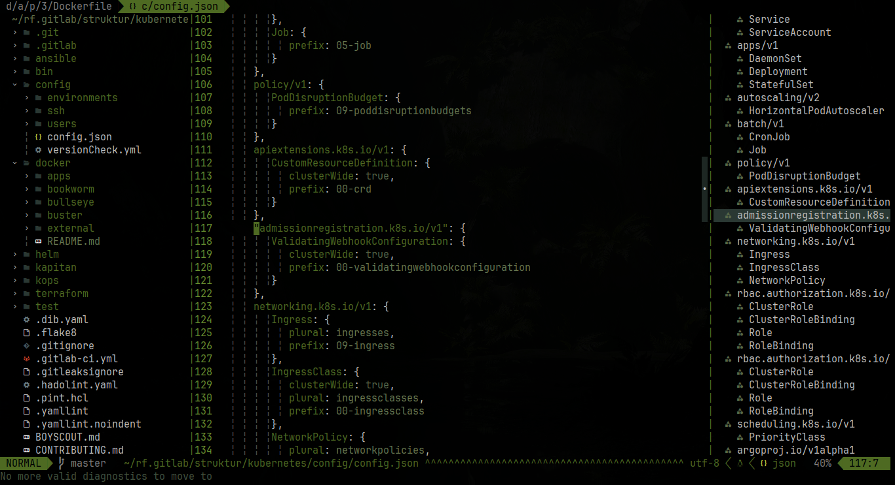
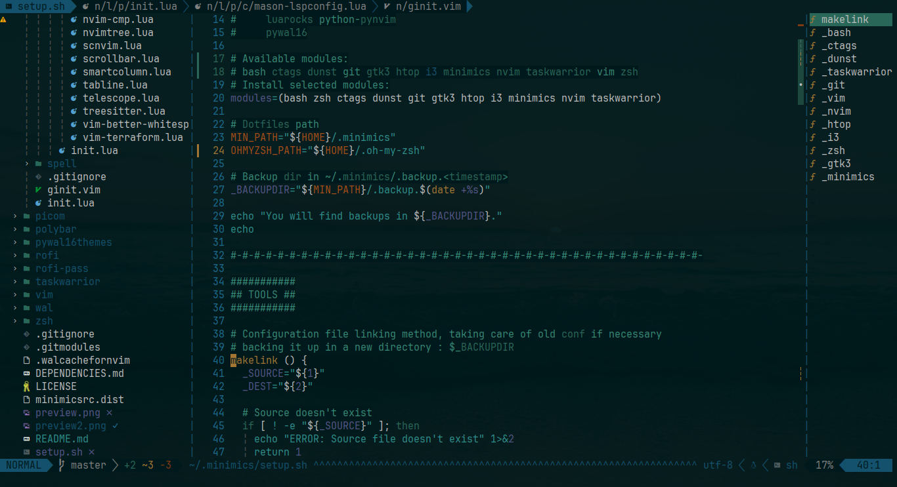

# matugen.nvim

matugen.nvim is a modification of
[pywal16.nvim](https://github.com/uZer/pywal16.nvim), aiming to support
a transparent background, 16 colors palettes, and more plugins.

It is made to work with [matugen](https://github.com/InioX/matugen),
which is a program capable of generating/supporting colorschemes similarly to (the now archived) pywal and pywal16

## Screenshots

(from upstream, but outputs should be similar/the same)



## External Plugin Support

- BetterWhitespace
- BufferLine
- Coc
- Diff
- Feline
- GitGutter
- Gitsigns
- Ident-BlankLine
- Illuminate
- LSP
- LSP saga
- LSP trouble
- Lualine
- Neogit
- NeoVim (checkhealth...)
- NvimTree
- Nvim-scrollbar
- Telescope
- Tree-sitter

## Installation

You can install this plugin with packer:

```lua
use { 'interbatles/matugen.nvim', as = 'matugen' }
```

Or with vim-plug:

```vim
Plug 'interbatles/matugen.nvim', { 'as': 'matugen' }
```

## Active theme

To active the theme, call this in your neovim config:

```lua
local matugen = require('matugen')

matugen.setup()
```

Or with vim script:

```vim
colorscheme matugen
```

> It will set automatically the `vim.opt.termguicolors` to true

## Activating lualine theme

Place this in your lualine config:

```lua
local lualine = require('lualine')

lualine.setup {
  options = {
    theme = 'matugen-nvim',
  },
}
```

## Using the core to get the colors

If you want to get the colors into a lua dictionary:

```lua
local matugen_core = require('matugen.core')
local colors = matugen_core.get_colors()
```

## How it works

```vim
" Special
let background = "#110914"
let foreground = "#e3cfe2"
let cursor     = "#e3cfe2"

" Colors
let color0  = "#110914"
let color1  = "#A378B6"
let color2  = "#B687AD"
let color3  = "#D9A2AF"
let color4  = "#F8DDAD"
let color5  = "#AD90CF"
let color6  = "#D2ACD6"
let color7  = "#e3cfe2"
let color8  = "#9e909e"
let color9  = "#A378B6"
let color10 = "#B687AD"
let color11 = "#D9A2AF"
let color12 = "#F8DDAD"
let color13 = "#AD90CF"
let color14 = "#D2ACD6"
let color15 = "#e3cfe2"
```

The theme only reads it files variables and then create a colors dictionary to
create a theme based in it's colors

## Enjoy

If you like this work you can give it a star :)
